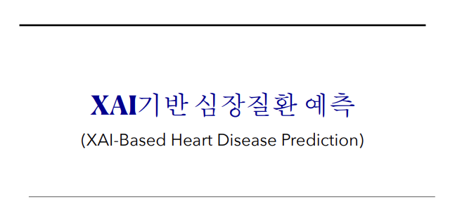
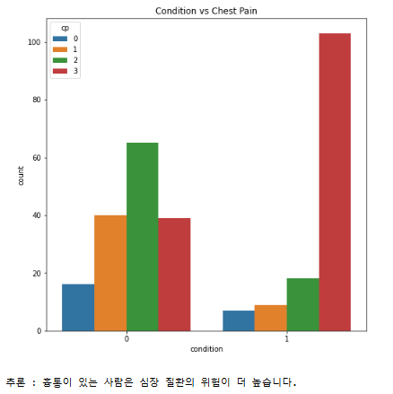
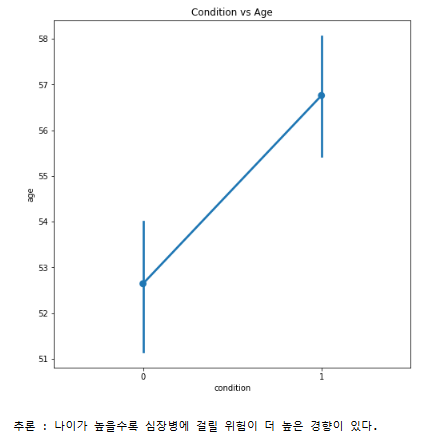
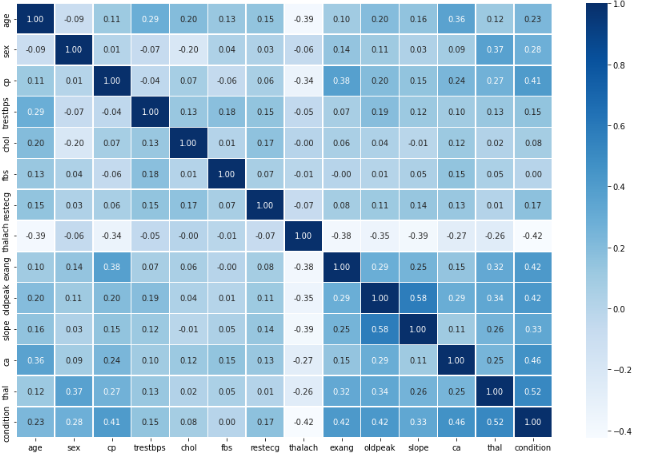
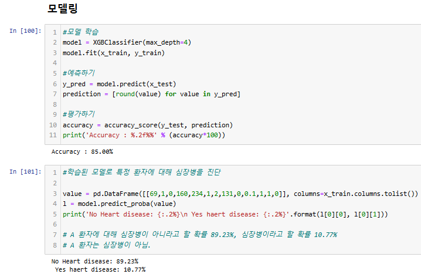
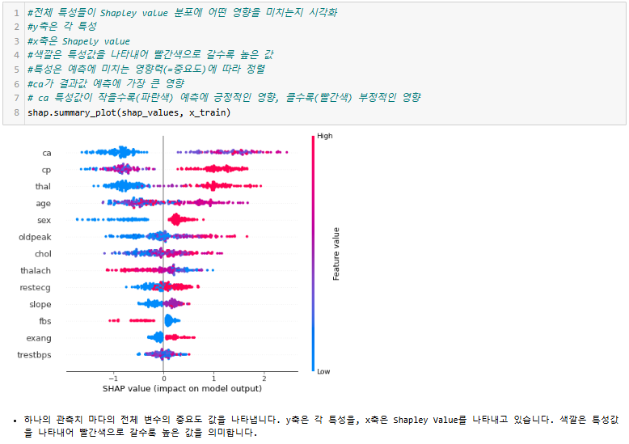
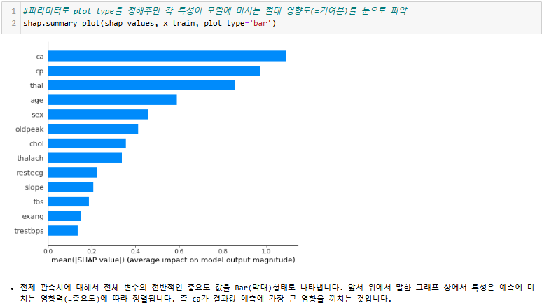
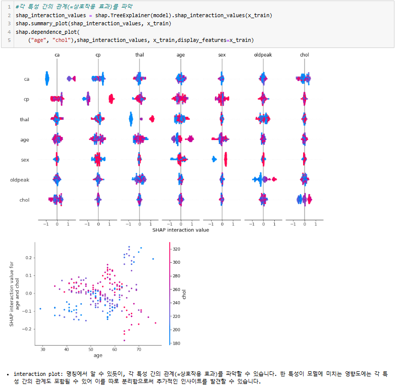

# XAI기반 심장질환 예측

 

## 1. 배경 & 목적

- 배경

    심장병은 전 세계적으로 사망의 주요 원인 중 하나로, 심장과 혈관에 영향을 미치는 질환(관상동맥질환, 심부전, 부정맥 등)이 포함됩니다. 이러한 심장 질환의 조기 발견과 정확한 진단은 환자의 생명을 구하는 데 매우 중요합니다. 그러나 기존의 진단 시스템은 의사의 주관적인 판단에 의존하는 경우가 많고, 복잡한 임상 데이터를 해석하는 데 한계가 존재합니다. 이러한 문제를 해결하고자, 의료 인공지능(AI) 기술이 대두되고 있으며, 특히 설명 가능한 인공지능(XAI)을 활용한 진단 보조 시스템에 대한 필요성이 커지고 있습니다.

- 목적

     - 심장 질환 예측 및 조기 발견: XAI 기반의 예측 모델을 개발하여 심장 질환을 조기에 예측하고, 환자에게 더 나은 치료 옵션을 제공하는 데 기여합니다.
     - 해석 가능성과 신뢰성 향상: XAI 기법을 통해 모델의 예측 결과를 해석 가능하게 만들어, 의료 전문가들이 모델의 결정을 신뢰할 수 있도록 합니다.
     - 의사 결정 지원: 의료 전문가들이 심장 질환을 진단하는 과정에서 AI의 예측을 보조적으로 활용함으로써, 진단의 정확성을 높이고 의료 서비스를 개선합니다.
     - 의료 비용 절감: 조기 진단과 효과적인 치료 계획 수립을 통해, 환자의 치료 비용을 절감하고 의료 시스템의 효율성을 향상시킵니다.

 

## 2. 주최/주관 & 팀원

- 주최/주관: 오픈소스 프로젝트
- 팀원: 이민서, 이지훈, 임태경, 조정우

 

## 3. 프로젝트 기간

- 2022.12. ~ 2023.01. (4주)

 

## 4. 프로젝트 소개

 이번 프로젝트의 목표는 심장질환을 예측하는 모델을 개발하고, 이를 설명 가능한 인공지능(XAI) 기술을 활용하여 모델의 예측 결과를 해석하는 것입니다. 이를 통해 의료 전문가들이 더 신뢰할 수 있는 진단 보조 도구를 제공하는 것을 목표로 하였습니다. 프로젝트는 다양한 머신러닝 모델을 활용하여 성능을 비교한 후, 최적의 모델을 선택하고 SHAP을 사용하여 예측 결과를 해석하는 과정으로 진행되었습니다.

- 데이터 이해 및 전처리
  - 데이터셋: 이 프로젝트에서 사용된 데이터셋은 심장질환의 위험 요인과 관련된 다양한 속성들을 포함하고 있습니다. 여기에는 나이, 성별, 가슴통증 유형, 휴식 시 혈압, 콜레스테롤 수치, 공복 혈당, 최대 심박수, 운동 후 협심증 여부, ST 분절 변화, 그리고 심장질환 여부 등이 포함되었습니다.
  - 결측치 처리: 일부 데이터 속성에서 결측치가 발견되었으나, 전체 데이터셋의 규모와 모델의 안정성을 고려하여 결측치를 가진 레코드는 제거하였습니다.
  - 데이터 정규화: 혈압, 콜레스테롤, 심박수 등 연속형 변수는 데이터의 스케일을 맞추기 위해 MinMaxScaler를 사용하여 0과 1 사이로 정규화하였습니다.
  - 가변수 변환: 범주형 변수(예: 가슴통증 유형, ST 분절 변화 등)는 One-Hot Encoding 기법을 사용하여 가변수로 변환하였습니다.
  - 데이터 불균형 처리:  데이터셋에서 심장질환을 가진 환자가 적은 편이었으므로, SMOTE(Synthetic Minority Over-sampling Technique)를 사용하여 데이터 불균형 문제를 해결하였습니다.

- 데이터 시각화 및 분석

    시각화 과정에서 Seaborn과 Matplotlib 라이브러리를 주로 사용하였으며, 이는 데이터를 직관적으로 이해할 수 있도록 다양한 차트와 그래프를 생성하였습니다.

    
    

    - 분석 내용

            - 나이: 심장질환은 나이가 많을수록 발병 확률이 높아지는 경향을 보였습니다.
            - 성별: 남성이 여성보다 심장질환 발병 확률이 높은 경향을 보였습니다.
            - 가슴통증 유형: 무증상 유형의 가슴통증(ASY)은 심장질환 발병과 강한 상관관계를 보였습니다.
            - 콜레스테롤: 높은 콜레스테롤 수치는 심장질환과 유의미한 상관관계를 보였습니다.
            - 최대 심박수: 낮은 최대 심박수는 심장질환 발병 위험이 높은 것으로 분석되었습니다.
            - 운동 후 협심증: 운동 후 협심증이 발생하는 경우, 심장질환 발병 확률이 높았습니다.

         

            

- 모델링

    심장질환의 존재를 정확하게 예측할 수 있는 효율적이고 확장 가능한 그레디언트 부스팅 라이브러리인 XGBoost를 이용

    - XGBoost Classifier

        - 모델 학습: XGBClassifier를 사용하여 심장병 예측 모델을 생성했습니다. max_depth=4로 설정한 모델을 학습 데이터(x_train, y_train)에 대해 학습시켰습니다.

        - 예측하기: 학습된 모델을 사용하여 테스트 데이터(x_test)에 대한 예측을 수행하였습니다. 예측된 확률 값을 반올림하여 최종 예측 결과를 도출했습니다.

        - 평가하기: 예측 결과를 실제 테스트 데이터의 정답(y_test)과 비교하여 모델의 정확도(Accuracy)를 계산하였으며, 그 결과는 85%였습니다.

        - 모델 특성에 따른 예측 결과: 특정 환자의 데이터를 입력으로 하여 모델이 예측한 심장병 진단 확률을 출력했습니다. 예를 들어, 특정 환자의 경우 심장병이 아닐 확률이 89.23%, 심장병일 확률이 10.77%로 계산되었습니다.

        

 - 설명 가능한 AI (XAI) 및 SHAP 분석

     - SHAP(SHapley Additive exPlanations): 모델의 예측을 해석하고 각 특성이 예측 결과에 얼마나 기여했는지를 시각적으로 이해하기 위해 SHAP 값을 사용하였습니다.
            
        - 분석 결과: SHAP 분석 결과, ST_Slope_Flat과 ChestPainType_ASY가 모델의 예측에 가장 크게 기여하는 특성으로 나타났습니다. 이러한 분석은 의료 전문가들이 모델의 결정을 신뢰할 수 있도록 돕고, 모델의 예측이 어떠한 요인들에 의해 이루어졌는지를 명확히 설명할 수 있도록 합니다.  
   
   
   

- 결론

    이번 프로젝트에서는 심장질환 예측을 위한 모델을 개발하고, 설명 가능한 인공지능(XAI) 기법을 활용하여 모델의 예측 결과를 해석하는 방법을 제시하였습니다.

    먼저, 다양한 전처리 기법을 통해 데이터의 품질을 높이고, 데이터 불균형 문제를 해결하여 모델 학습의 안정성을 확보하였습니다. 그런 다음, XGBoost Classifier를 사용하여 심장질환을 예측하는 모델을 구축하였으며, 그 결과 85%의 높은 정확도를 달성하였습니다.

    특히, SHAP(SHapley Additive exPlanations) 기법을 활용하여 모델의 예측 결과를 해석할 수 있도록 하였습니다. SHAP 분석을 통해 ST_Slope_Flat과 ChestPainType_ASY와 같은 특정 특성이 예측 결과에 크게 기여하는 것을 확인하였으며, 이는 의료 전문가들이 모델의 예측을 신뢰하고 이를 임상에 적용할 수 있도록 돕는 중요한 정보입니다.

    본 프로젝트를 통해 개발된 모델과 분석 방법은 심장질환의 조기 예측과 진단에 있어 중요한 도구가 될 수 있습니다. 특히, XAI 기법을 적용함으로써 모델의 투명성과 신뢰성을 높일 수 있었으며, 이는 의료 현장에서 인공지능을 효과적으로 활용하는 데 기여할 것으로 기대됩니다. 앞으로 이 모델을 더욱 발전시켜, 더 많은 환자에게 적용하고 그 효과를 검증하는 연구가 필요할 것입니다.

 

## 5. 프로젝트 담당 역할

- 변수 별 상관관계 분석 및 시각화

     - 데이터 전처리 후, 주요 변수들(나이, 성별, 가슴통증 유형, 혈압, 콜레스테롤 수치, 최대 심박수, 운동 후 협심증 등)에 대한 시각화를 통해 변수 간의 관계 및 심장질환 여부와의 상관관계를 분석
     - Seaborn과 Matplotlib 라이브러리를 활용하여 countplot, pointplot, heatmap 등을 사용한 다양한 시각화 작업 수행
     - 분석 결과를 통해 주요 변수들이 심장질환 예측에 미치는 영향을 파악하고, 이를 모델링 과정에 반영

- XGBoost 모델 개발

     - XGBoost Classifier를 활용하여 심장질환 예측 모델을 개발
     - 모델 학습 후 테스트 데이터를 사용하여 예측 성능을 평가하여, 최종적으로 85%의 예측 정확도를 달성
     - SHAP(SHapley Additive exPlanations) 분석을 통해 모델의 예측 결과를 해석하고, 각 특성이 모델 예측에 미치는 영향을 시각적으로 이해 가능하도록 지원

 